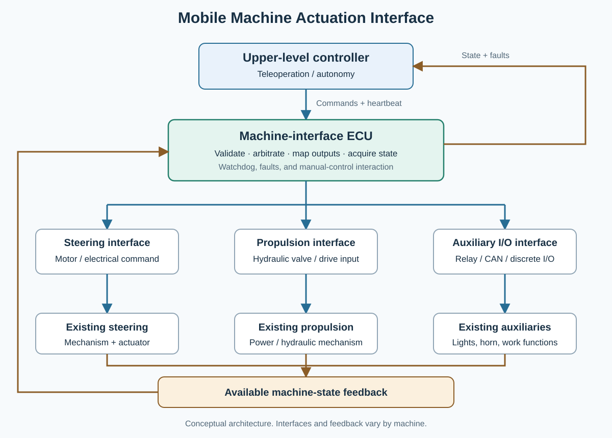

# Mobile Machine Actuation Interface

**English** · [简体中文](README.zh-CN.md)

A hardware/software interface for retrofitting remote or autonomous control onto
electromechanical and electrohydraulic mobile machines.

MMAI connects an upper-level controller to the steering, propulsion, auxiliaries,
and available state feedback of an existing machine. This repository presents
the engineering approach through schematics, firmware, interface code, and its
development history. Read the source as working design material: it records the
hardware, communication, and actuation choices behind the ECU.

## What it does

- Receives commands from teleoperation or autonomy software.
- Validates commands and manages control authority, timeouts, and output enable.
- Maps commands to electrical interfaces such as relays, CAN-controlled actuators,
  or PWM-driven hydraulic valve coils.
- Acquires machine and actuator state and sends feedback to the upper layer.
- Keeps low-level machine behavior understandable independently of a planner.

The same architecture can be adapted to street sweepers, compactors, agricultural
machines, utility vehicles, and other mobile equipment. The appropriate actuator,
wiring, feedback, and stop behavior depend on the machine. Analog command outputs
or additional serial interfaces are adaptation options, not capabilities implied
for every board in this repository.

## Architecture

The machine-interface ECU sits between the command source and the physical
machine. Steering, propulsion, and auxiliary I/O are separate adaptation paths;
state feedback closes the path through the ECU. Existing manual controls and
machine interlocks are part of that integration.

Upper-level navigation, perception, and route planning are outside the core
actuation boundary. The retained implementation focuses on low-level actuation
and state feedback. See [Architecture](docs/architecture.md)
and [Interfaces](docs/interfaces.md).

## Implementation map

| Area | Start here | What to look for |
| --- | --- | --- |
| H563 actuation ECU | [Hardware project](pcb/roller/ecu/PROJECT1.kicad_pro), [firmware](firmware/roller/ECU/) | Relay switching, proportional-valve current control, CAN steering, protected control boundary |
| Mechanical material | [CAD](cad/), [PCB sources](pcb/) | Physical integration and board development |

Historical directory names are retained so code, drawings, and commits remain
easy to trace. They do not define the scope of the general architecture.

## A useful reading order

1. Read the [hardware guide](docs/hardware.md) and open the corresponding schematic.
2. Follow a command through the [firmware guide](docs/firmware.md): parser, control
   policy, machine mapping, then physical driver.
3. Follow feedback in the opposite direction, checking units and validity flags.
4. Compare earlier revisions using the [project history](docs/PROVENANCE.md).
5. Use the [porting guide](docs/porting-guide.md) to describe a different machine.

The H563 example includes an Ethernet command/state protocol, CAN interfaces,
relay/contact outputs, PWM valve drivers with current sensing, and analog,
discrete, and pulse inputs. Its wire protocol and I/O assignments are concrete
implementation choices; they are not a universal machine API.

## Safety and bench exploration

This is experimental engineering material, not a certified functional-safety
controller or a ready-to-install vehicle conversion. Physical deployment needs
machine-specific engineering. Begin any electrical exploration with isolated
signals and dummy loads, and understand startup, command-loss, manual-control,
and emergency-stop behavior before connecting actuators. See [Safety](docs/SAFETY.md).

## History and related work

The repository lineage begins in 2024. The public source centers on the
machine-interface ECU hardware and firmware, with retained design revisions
and technical notes. [Provenance](docs/PROVENANCE.md) identifies source milestones.

Electronic and electrohydraulic machine actuation has a long public engineering
history. [Prior art and related systems](docs/PRIOR_ART.md) provides technical
references for understanding these established approaches.

## License and contributions

Original project contributions use [BSD-2-Clause](LICENSE), subject to existing
file-specific notices. Bundled third-party material retains its own terms and
attribution; see the [license index](LICENSES/README.md).

Corrections, explanations, and clearly attributed design contributions are welcome.
See [Contributing](CONTRIBUTING.md) and [Security](SECURITY.md).
