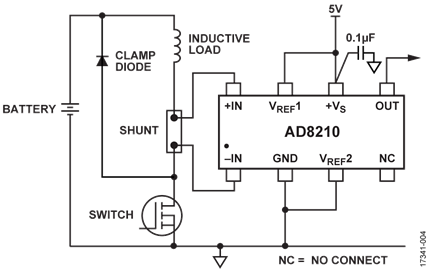

# ECU 原理图设计来源与开放复现指南

本文档介绍 ECU 原理图 `PROJECT1.kicad_sch` 及 `PAGE1.kicad_sch`～`PAGE9.kicad_sch` 的设计来源、功能分层和复现路径。本项目以器件厂商公开资料、开源硬件项目和公开控制方法为基础，将电源、通信、继电器矩阵、比例阀驱动和采集接口组合为可复核的 ECU 电路。

阅读本文档时，可以先按 PAGE 查找电路，再通过来源编号打开对应的原理图、数据手册、应用笔记或开源项目。来源编号与电路编号保持稳定，便于后续修改原理图时继续追踪设计依据。

## 来源使用方式

本项目采用三层来源协同设计：

1. **器件与接口层**：使用官方数据手册、典型应用和参考设计确定引脚连接、保护、额定值和布局要点。
2. **开源实现层**：参考带有明确许可证的开源硬件和软件项目，吸收低边比例阀恒流驱动、PWM 控制、继电器矩阵和车辆安全链路等实现方法。

本项目的原理图是上述公开来源的工程化组合，具体器件、参数、通道数量和 PCB 实现由本项目定义，并在各 PAGE 的来源映射中记录。

## 复现路径

1. 从“电路划分与来源映射”选择目标 PAGE 和电路 ID。
2. 按来源编号阅读对应的官方资料或开源项目文件，确认拓扑、接口和控制方法。
3. 对照原理图、BOM 和 PCB 规则检查器件参数、额定值、保护和散热条件。
4. 在样机阶段完成电源瞬态、负载电流、通信质量、EMC、温升和安全状态测试，再固化参数和装配版本。

## 证据等级

| 等级 | 含义 | 在本项目中的用途 |
| --- | --- | --- |
| A | 同型号器件的官方典型应用、参考原理图或评估板与本页拓扑近似 | 作为电路拓扑和关键连接的直接设计依据 |
| B | 同型号官方数据手册/应用笔记给出的连接规则、接口电路或设计方法 | 支持局部电路、器件选型和控制方法 |
| C | 公开的通用原理、相邻型号资料或器件能力说明 | 支持工程实现方向，参数由本项目进一步验证 |

## 系统级方案

系统级方案把公开资料转换为本项目的可实现电路模块。每个模块都保留来源编号，使用者可以从功能目标一路追溯到公开原理图、控制方法和器件资料。

### 比例阀低边恒流驱动

#### CN0415 参考设计摘要

本项目采用 [ADI CN0415：Robust, Closed-Loop Control and Monitoring System for Solenoid Actuators](https://www.analog.com/en/resources/reference-designs/circuits-from-the-lab/cn0415.html#rd-description) 作为比例电磁阀驱动的主要公开电路参考，来源条目为 [S38](#s38)。CN0415 页面中的 `Circuit Function & Benefits`、`Circuit Description` 和 `Digital PID Control` 章节，完整说明了比例电磁阀的驱动、采样和保护链路。

CN0415 的示例采用低边开关与高边分流采样；本项目沿用其 PWM、闭环、dither、栅极驱动和过流保护的功能链路，并按 PAGE7 的器件和低边分流器布局实现。相关电流采样与汽车比例阀资料还包括 [S21](#s21)、[S39](#s39)、[S40](#s40)、[S41](#s41) 和 [S42](#s42)。

#### 比例阀驱动拓扑

参考电路

*图示来源：[Analog Devices CN0415](https://www.analog.com/en/resources/reference-designs/circuits-from-the-lab/cn0415.html#rd-description)，对应原文 Figure 4。*

MCU 输出 PWM，栅极驱动器控制 N-MOSFET，INA240 测量线圈电流并提供闭环反馈。比例阀的控制量以线圈电流为核心，并预留死区补偿、峰值/保持和 dither 参数。OpenHumidistat、PneuSoRD 和 AgOpenGPS 分别提供低边恒流驱动、比例阀 PWM 功率级以及双 PWM 液压比例阀控制的开源实现参考，来源见 [S47](#s47)、[S48](#s48)、[S49](#s49) 和 [S50](#s50)。

### 改装车辆信号切换

本项目使用继电器矩阵对改装车辆信号进行可控切换：需要替代的信号按照 **break-before-make** 顺序先断开原路径，再接通替代路径；同一信号组保持互斥；无需切断的信号通过受控电源或低边接地直接控制。继电器由串行低边驱动器级联扩展，掉电、复位和故障状态回到安全态。

OpenPodcar 提供车辆点火线切断、COM/NO 继电器和 Deadman 安全链路的开源实现；relay_matrix_edsp 提供交叉点矩阵、级联驱动和互斥命令；Subaru BRZ VCU 提供低边继电器、受控电源/地和信号复用的公开设计说明；TPIC6A595 提供本项目所需的串行低边感性负载驱动。对应来源见 [S13](#s13)、[S43](#s43)、[S44](#s44)、[S45](#s45) 和 [S46](#s46)。

## 电路划分与来源映射

### PAGE1 — 电源变换与状态指示

| ID | 电路与覆盖范围 | 公开依据（文档定位） | 等级 | 本项目实现说明 |
| --- | --- | --- | --- | --- |
| P1-01 | 高电流同步降压：`U8`、`L2` 及其输入、输出、反馈、频率设定和去耦网络 | [S01](#s01)，Figure 10，p.69 | A | 同为 MPQ4371-1000 的 5 V、2.2 MHz 典型应用；反馈、频率设定、输入/输出电容结构高度一致。工程中的器件额定值、并联数量及使能/模式配置需以原理图和负载验证为准。 |
| P1-02 | 小功率同步降压：`U9`、`L1` 及 `C7,C10-C12,C14-C18,C23,C25,C26,R23-R30,R32,R33,R50,R60,R61,R64` | [S02](#s02)，Application Information 与 Typical Application Circuits，pp.21–25 | A | 拓扑、软启动、反馈、输入/输出去耦与 MPQ2178 典型应用一致。 |
| P1-03 | 两组电源良好/状态指示与开漏缓冲：`Q1,Q9,D7,D14,R34,R35,R63,R65,R66` | [S01](#s01)，Power Good；[S02](#s02)，Power Good；[S15](#s15)，MOSFET switching application | B | 本项目依据开漏状态输出和外部上拉规则设计 LED 与小信号 MOSFET 指示级，具体电阻和指示方式由工程需求确定。 |

### PAGE2 — MCU、时钟、复位、调试与安全器件

| ID | 电路与覆盖范围 | 公开依据（文档定位） | 等级 | 本项目实现说明 |
| --- | --- | --- | --- | --- |
| P2-01 | MCU 供电、模拟参考、内部稳压电容与就地去耦：`U1` 及 `C6,C28-C46,C51,R36,R37` | [S03](#s03)，Figures 2、15、19，pp.5、36、40 | A | AN5711 明确覆盖 STM32H563 系列的电源域、参考设计和去耦布局；具体电容分配需结合所用封装引脚逐项核对。 |
| P2-02 | 外部复位按键、上拉/滤波与 ESD：`SW1,D1,R49,C46` | [S03](#s03)，Figure 9，p.15；[S28](#s28) | B | 复位网络符合 STM32H5 硬件指南，ESD 器件能力由其官方数据手册支持；保护等级仍取决于布局与脉冲源阻抗。 |
| P2-03 | 启动配置跳线：`JP1` 及相邻配置电阻 | [S03](#s03)，Boot configuration，p.26 | B | 文档给出启动脚配置原则；跳线形式及默认状态是工程选择。 |
| P2-04 | 25 MHz 高速外部晶振：`Y2,C47,C48` | [S04](#s04)，§§3–4（Pierce oscillator、load capacitance、crystal selection） | B | 结构符合 Pierce 振荡器；负载电容必须按晶体 CL、引脚和 PCB 寄生重新核算。 |
| P2-05 | 32.768 kHz 低速外部晶振：`Y1,C49,C50` | [S04](#s04)，§§3–4；[S03](#s03)，clock recommendations | B | 结构与低速晶体网络一致；低功耗晶体的驱动裕量和负阻测试不由原理图本身证明。 |
| P2-06 | SWD 调试接口：`J1` | [S03](#s03)，Figure 12，p.30 | A | 信号集合与 STM32H5 官方 SWD 连接方式一致；连接器针序是项目实现。 |
| P2-07 | I²C 安全器件及去耦/上拉：`U221,R105,R106,C45` | [S05](#s05)，Figure 1 与 Table 1；[S06](#s06)，DT100104 schematic，sheet 1 | A | 官方板原理图展示 ATECC608C 的 I²C、上拉和 100 nF 去耦。地址/配置区内容不在原理图可追溯范围内。 |

### PAGE3 — 10/100 Ethernet PHY 与物理接口

| ID | 电路与覆盖范围 | 公开依据（文档定位） | 等级 | 本项目实现说明 |
| --- | --- | --- | --- | --- |
| P3-01 | RMII PHY、偏置、内部稳压电容与电源滤波：`U4,FB1,R53,C54-C63` 及相邻去耦 | [S07](#s07)，p.13 与 Figures 3-20、3-21，pp.53–54 | A | 12.1 kΩ RBIAS、内部 1.2 V 稳压电容和单电源连接与 LAN8742A 官方应用图一致。 |
| P3-02 | PHY 25 MHz 晶振：`Y3,C52,C53` | [S07](#s07)，clock/oscillator sections；[S04](#s04)，§§3–4 | B | PHY 数据手册规定时钟接口，AN2867提供晶体负载核算方法；实际起振裕量需测试。 |
| P3-03 | MDI 端接、共模磁性器件与外部连接器：`R58,R59,R67,R68,R54-R56,C64,T201,J3` | [S07](#s07)，Figure 3-23，p.56；[S08](#s08)；[S09](#s09) | A | 49.9 Ω 端接、磁性器件、Bob Smith 类端接与官方单电源双绞线接口图一致；连接器由项目改为 M12 X-code，针序须按其图纸核对。 |
| P3-04 | 高速线 ESD 保护：`U5` | [S10](#s10)，Application Diagrams 与 PCB layout recommendations | B | USBLC6-4 的低电容多线保护结构可用于高速差分接口；具体 IEC 等级依赖布局，且该器件名称并不把用途限定为 USB。 |
| P3-05 | PHY 状态 LED 与串联电阻：`D19,D20,R51,R57` | [S07](#s07)，LED pins/configuration | B | PHY 提供 LED 输出及配置说明；颜色、亮度和电阻值为工程选择。 |
| P3-06 | RMII 串联阻尼/配置电阻：`R38-R48,R69,R70,R113-R115` | [S07](#s07)，RMII interface、strap inputs 与 layout guidance | B | 数据手册支持启动配置和数字接口布线原则；33 Ω 阻尼值须结合走线阻抗和边沿测量确认。 |

### PAGE4 — 两路 CAN 物理层

| ID | 电路与覆盖范围 | 公开依据（文档定位） | 等级 | 本项目实现说明 |
| --- | --- | --- | --- | --- |
| P4-01 | 两个同构 CAN 收发与可配置 120 Ω 端接通道：`U13,U14,C40,C85,R42,R43,R107,R108` | [S11](#s11)，Figures 38–39，p.27 | A | 官方图给出 CAN 总线与 120 Ω 端接原则；0 Ω 配置电阻使端接是否接入由装配方案决定。 |
| P4-02 | 两路 CAN 线对浪涌/ESD 保护：`D21,D22` | [S12](#s12)，High-Speed/Fault-Tolerant CAN Surge Protection application figure | A | NUP2105L 官方应用图即为 CANH/CANL 双线保护；最终抗扰度仍需结合接地回路和 PCB 布局验证。 |

### PAGE5 — 继电器驱动逻辑与串行低边驱动

| ID | 电路与覆盖范围 | 公开依据（文档定位） | 等级 | 本项目实现说明 |
| --- | --- | --- | --- | --- |
| P5-01 | 继电器驱动前端与四片低边驱动器组合链：`U300,U301-U304,Q6,C5,C21,C66-C68,R71-R78` | [S14](#s14)，Function Table、三态输出与电源建议；[S37](#s37)，SN74AHCT541-Q1 产品资料；[S13](#s13)，§7.3.3、§7.3.4，p.13 | B | 本项目使用 `SN74AHCT541QPWRQ1` 完成受使能控制的并行逻辑，使用 `TPIC6A595DWR` 完成串入并出、开漏低边输出、感性负载钳位和级联，形成四片低边继电器驱动链。 |
| P5-02 | TPIC 输出级及四片级联：`U301-U304,C5,C21,C66,C67,R71-R74` | [S13](#s13)，§7.3.3 与 §7.3.4 Cascaded Application，p.13 | A | SER OUT 到下一片 SER IN、低边开漏 DMOS 和感性负载钳位均由官方资料明确给出；负载数量与映射为工程定制。 |
| P5-03 | 小信号 MOSFET 控制/电平处理：`Q6,R77` | [S15](#s15)，Description and Applications | C | 本项目依据器件的开关和电源管理能力完成电平处理，Q6/R77 的阈值、速度和负载条件在样机测试中验证。 |

### PAGE6 — 继电器触点矩阵（触点组合不展开）与电源储能

| ID | 电路与覆盖范围 | 公开依据（文档定位） | 等级 | 本项目实现说明 |
| --- | --- | --- | --- | --- |
| P6-01 | 继电器触点矩阵：`K1-K27` | [RLY-SYS-01](#rly-sys-01)；[S16](#s16) | — | 本项目重点记录矩阵的驱动、切换行为和安全时序；逐触点组合由工程连接表维护，车辆信号断开、替代切换、直接电源/地接入见 RLY-SYS-01。 |
| P6-02 | 继电器电源母线储能：`C22,C69-C71` | [S17](#s17)，Input and Output Capacitor Selection，bulk-capacitance discussion | C | 并联大容量电容符合负载阶跃储能的一般原则；容量、ESR、纹波电流、浪涌及故障能量必须按实际继电器同时动作数验证。 |

### PAGE7 — 两路功率低边驱动与电流检测

| ID | 电路与覆盖范围 | 公开依据（文档定位） | 等级 | 本项目实现说明 |
| --- | --- | --- | --- | --- |
| P7-01 | 两个比例电磁阀低边驱动通道：`U10,U11,Q2,Q3,D2,D3,R79-R82,C72-C75` | [比例阀低边恒流驱动](#sol-os-01)；[S38](#s38)；[S18](#s18)，Typical Application；[S19](#s19)；[S20](#s20) | B | 本项目采用 UCC27517A-Q1 控制 N-MOSFET，STPS5L60SY 提供续流路径，并以闭环电流建立比例阀控制量；CN0415 提供 PWM、dither、栅极驱动和过流保护的系统级参考。 |
| P7-02 | 两路 50 mΩ 分流电阻与 INA240 电流检测：`R1,R2,U6,U12,R83,R84,C76,C77` | [比例阀低边恒流驱动](#sol-os-01)；[S38](#s38)；[S21](#s21)，§9.2.2、§9.3.2；[S22](#s22) | B | 本项目采用 INA240 的 PWM 抑制和 Kelvin 采样方法；分流器为 50 mΩ、3 W，采样增益、量程、功耗和滤波按实际阀线圈验证，功能链路对应 CN0415 的电流监测和闭环控制。 |

### PAGE8 — 模拟量、温度、隔离量与脉冲输入

| ID | 电路与覆盖范围 | 公开依据（文档定位） | 等级 | 本项目实现说明 |
| --- | --- | --- | --- | --- |
| P8-01 | 四个同构的受保护模拟输入：`D4,D9,R85,R86,R94,C78`；`D12,D13,R91,R97,R98,C82`；`D15,D16,R99-R101,C83`；`D17,D18,R102-R104,C84` | [S23](#s23)，ADC input impedance/RC guidance；[S24](#s24)；[S25](#s25) | B/C | 本项目采用分压、串联限流、RC 低通和轨钳位构成 MCU ADC 前端；`ESD5V0D5` 当前按同型号公开参数建库，最终订货号在 BOM 阶段确认。 |
| P8-02 | 两个同构 NTC 分压/滤波输入：`J2,R109,R110,C86`；`J4,R111,R112,C87` | [S26](#s26)，Monitoring NTC Thermistor Circuit With Single-Ended ADC | B | 电阻分压与 ADC 输入电容的结构一致；NTC 的 B 值、标称阻值、线束电阻和温度换算表须由实际探头补充。 |
| P8-03 | 电源电压分压、RC 滤波与双肖特基钳位：`R92,R93,R95,R96,C79,D10` | [S23](#s23)，ADC input protection/RC guidance；[S24](#s24) | B | 结构符合高压量测的电阻分压和限流钳位原则；量程与故障注入电流需按 ADC 绝对最大额定值重新计算。 |
| P8-04 | 光耦隔离数字输入：`R117,R118,U15,R121,R122,C80` | [S27](#s27)，Figure 1 switching test circuit 与 electrical characteristics；[S31](#s31) | B | 输入限流、光晶体管输出上拉和滤波有器件/应用资料支持；阈值、CTR 老化裕量与现场电压范围是项目参数。 |
| P8-05 | 受保护的脉冲整形输入：`D8,R87,R88,D11,Q4,R89,C81,U7,R90` | [S29](#s29)，Schmitt-trigger input；[S30](#s30)；[S24](#s24) | B/C | 本项目使用 TVS/肖特基限制瞬态，使用 BJT 完成电平和电流处理，再由施密特反相器恢复边沿；整体按 C 级组合电路进行验证，各器件规则按 B 级执行。 |

### PAGE9 — 电源入口、反接保护与连接/机械件

| ID | 电路与覆盖范围 | 公开依据（文档定位） | 等级 | 本项目实现说明 |
| --- | --- | --- | --- | --- |
| P9-01 | 入口双向 TVS 与高低频旁路：`D5,C88,C89` | [S32](#s32)，SMCJ24CA-Q electrical characteristics；[S17](#s17) | B | 器件型号对应 24 V、1500 W、双向汽车级 TVS；电容并联用于宽频旁路。整机脉冲等级仍取决于源阻抗、线束和布局。 |
| P9-02 | 理想二极管控制器与外部 N-MOSFET 反接/反向电流保护：`U2,Q5` | [S33](#s33)，Typical Application Schematic 与 Figure 3；[S34](#s34) | A | LM74700-Q1 官方典型图即采用外部 N 沟道 MOSFET，并包含入口 TVS/电容；所选 60 V MOSFET 的耐压、导阻和热设计需针对实际浪涌复核。 |
| P9-03 | 两个密封板端连接器：`J6,J7` | [S35](#s35)；[S36](#s36) | A | 厂商页面/图纸分别确认 35 位和 23 位 AMPSEAL 直角板端连接器。针位的电气分配属于工程定义。 |
| P9-04 | 带焊盘安装孔：`H1-H4` | 本工程机械/接地实现，无唯一外部参考电路 | C | 位号覆盖完整；是否连接机壳、保护地或信号参考必须结合 PCB、结构和 EMC 方案判断。 |

## 公开来源

访问日期均为 **2026-09-17**。

### 开源实现来源

| 来源 | 许可证/开放方式 | 本项目采用的设计要点 |
| --- | --- | --- |
| [S43](#s43) OpenPodcar | 软件 GPL-2.0，硬件 CERN-OHL-W | 车辆点火线切断、继电器切换和 Deadman 安全链路 |
| [S46](#s46) relay_matrix_edsp | MIT | 交叉点矩阵、级联驱动、互斥命令和状态查询 |
| [S47](#s47) PneuSoRD | MIT | 比例阀 PWM、降压功率级、过流保护和多通道驱动 |
| [S48](#s48) HW_for_AgOpenGPS | CERN-OHL-S-2.0（硬件） | 双 PWM 液压比例阀、反馈控制和开源农机执行器接口 |
| [S49](#s49) OpenHumidistat/hardware | CERN-OHL-S-2.0 | 两路低边 VCCS 恒流比例阀驱动、KiCad 原理图/PCB/BOM |
| [S50](#s50) OpenHumidistat 论文 | 公开论文与配套开源设计 | PWM 输入、恒流控制、温升补偿和比例阀闭环方法 |

### 详细来源条目

本节采用标准文献条目格式，仅列出机构/作者、文献题名、版本或出版信息、章节/图表定位和原始链接；电路与本项目的对应关系统一记录在上方的 PAGE 表格和系统级方案中。

**S01 — Monolithic Power Systems, MPQ4371-AEC1 Datasheet**, Rev. 1.0 (2024-03-21), Figure 10 “Typical Application Circuit for MPQ4371-1000”, p. 69. 
https://www.monolithicpower.com/en/documentview/productdocument/index/version/2/document_type/Datasheet/lang/en/sku/MPQ4371GVE-AEC1/

**S02 — Monolithic Power Systems, MPQ2178-AEC1 Datasheet**, Rev. 1.1 (2023-05-04), Application Information; Typical Application Circuits, pp. 21–25. 
https://www.monolithicpower.com/en/documentview/productdocument/index/version/2/document_type/Datasheet/lang/en/sku/MPQ2178GQHE-AEC1/

**S03 — STMicroelectronics, AN5711: Getting started with STM32H5 MCU hardware development**, Rev. 3, Figures 2, 9, 12, 15, 19. 
https://www.st.com/resource/en/application_note/an5711-getting-started-with-stm32h5-mcu-hardware-development-stmicroelectronics.pdf

**S04 — STMicroelectronics, AN2867: Oscillator design guide for STM8AF/AL/S, STM32 MCUs and MPUs**, Rev. 21, §§ 3–4. 
https://www.st.com/resource/en/application_note/an2867-oscillator-design-guide-for-stm8afals-stm32-mcus-and-mpus-stmicroelectronics.pdf

**S05 — Microchip, CryptoAuthentication ATECC608C Summary Data Sheet**, DS40002513, Figure 1; Table 1. 
https://ww1.microchip.com/downloads/aemDocuments/documents/SCBU/ProductDocuments/DataSheets/ATECC608C-CryptoAuthentication-Summary-Data-Sheet-DS40002513.pdf

**S06 — Microchip, DT100104 Schematic**, Rev. 5 (2024-05-06), sheet 1. 
https://ww1.microchip.com/downloads/aemDocuments/documents/SCBU/ProductDocuments/BoardDesignFiles/DT100104-Schematic.PDF

**S07 — Microchip, LAN8742A/LAN8742Ai Datasheet**, DS00001989A, § 3.9, Figures 3-20, 3-21, 3-23. 
https://www.microchip.com/content/dam/mchp/documents/OTH/ProductDocuments/DataSheets/DS_LAN8742_00001989A.pdf

**S08 — Bourns, SM91071AL 10/100 Base-T Transformer Datasheet**. 
https://www.bourns.com/docs/product-datasheets/sm91071al.pdf

**S09 — Cinch Connectivity Solutions, SS-12400-004 product page and drawings**. 
https://www.cinch.com/products/ethernet-usb/connectors/m-series-connectors/ss-12400-004

**S10 — STMicroelectronics, USBLC6-4 Datasheet**, application diagrams; layout recommendations. 
https://www.st.com/resource/en/datasheet/usblc6-4.pdf

**S11 — Texas Instruments, SN65HVD230/SN65HVD231/SN65HVD232 Datasheet**, Rev. O, Figures 38–39, p. 27. 
https://www.ti.com/lit/ds/symlink/sn65hvd230.pdf

**S12 — onsemi, NUP2105L Dual Line CAN Bus Protector Datasheet**, High-Speed/Fault-Tolerant CAN Surge Protection application figure. 
https://www.onsemi.com/download/data-sheet/pdf/nup2105l-d.pdf

**S13 — Texas Instruments, TPIC6A595 Power Logic 8-Bit Shift Register Datasheet**, Rev. C, §§ 7.3.3–7.3.4, p. 13. 
https://www.ti.com/lit/ds/symlink/tpic6a595.pdf

**S14 — Texas Instruments, SN74AHCT541 Octal Buffer/Driver Datasheet**, function table; application information. 
https://www.ti.com/lit/ds/symlink/sn74ahct541.pdf

**S15 — Diodes Incorporated, 2N7002KQ Datasheet**, DS43528, Description and Applications. 
https://www.diodes.com/datasheet/download/2N7002KQ.pdf

**S16 — Hongfa, HFV6 Automotive Relay product page/data sheet**, 1 Form A; 1 Form C; ratings. 
https://www.hongfa.com/Product/automotive-relay/HFV6

**S17 — Texas Instruments, SLTA055: Input and Output Capacitor Selection**, bulk-capacitance; ESR selection. 
https://www.ti.com/lit/pdf/slta055

**S18 — Texas Instruments, UCC27517A-Q1 Single-Channel Low-Side Gate Driver Datasheet**, Typical Application. 
https://www.ti.com/lit/ds/symlink/ucc27517a-q1.pdf

**S19 — onsemi, NVD5C684NL 60 V N-Channel MOSFET Datasheet**, Rev. 2 (2024-07). 
https://www.onsemi.com/download/data-sheet/pdf/nvd5c684nl-d.pdf

**S20 — STMicroelectronics, STPS5L60-Y Automotive Power Schottky Rectifier Datasheet**, Doc ID 022951 Rev. 1. 
https://www.st.com/resource/en/datasheet/stps5l60-y.pdf

**S21 — Texas Instruments, INA240 Datasheet**, Rev. C, § 9.2.2, Figure 9-5. 
https://www.ti.com/lit/ds/symlink/ina240.pdf

**S22 — TE Connectivity, TLRP3A30DR050FTE product page**, 0.05 Ω, 3 W, 1% current-sense resistor; document ENG_DS_1773449-4_D3. 
https://www.te.com/en/product-6-2176422-7.html

**S23 — STMicroelectronics, AN2834: How to optimize the ADC accuracy in the STM32 MCUs**, Rev. 10 (2024-10), ADC source impedance; RC network design. 
https://www.st.com/resource/en/application_note/an2834-how-to-optimize-the-adc-accuracy-in-the-stm32-mcus-stmicroelectronics.pdf

**S24 — Diodes Incorporated, BAT54S Datasheet**, DS11005, dual Schottky series configuration. 
https://www.diodes.com/assets/Datasheets/ds11005.pdf

**S25 — Micro Commercial Components, ESD3V3D5/ESD5V0D5/ESD7V0D5/ESD12VD5 Datasheet**, Rev. 3 (2019-01). 
https://www.mouser.com/datasheet/2/258/ESD3V3D5_7eESD12VD5%28SOD-523%29-V1-1626101.pdf

**S26 — Texas Instruments, SBAA338A: Monitoring NTC Thermistor Circuit With Single-Ended ADC**, Rev. A (2022-06). 
https://www.ti.com/lit/an/sbaa338a/sbaa338a.pdf

**S27 — Broadcom, ACPL-214/ACPL-217 Datasheet**, AV02-0469EN, Figure 1; electrical characteristics. 
https://docs.broadcom.com/doc/AV02-0469EN

**S28 — Nexperia, PESD5V0S1BA-Q Datasheet**. 
https://assets.nexperia.com/documents/data-sheet/PESD5V0S1BA-Q.pdf

**S29 — Texas Instruments, SN74LVC1G14 Datasheet**, Rev. AA, § 6.3.2 “Schmitt-Trigger Inputs”. 
https://www.ti.com/lit/ds/symlink/sn74lvc1g14.pdf

**S30 — STMicroelectronics, SM6T Transil Series Datasheet**. 
https://www.st.com/resource/en/datasheet/sm6t.pdf

**S31 — Texas Instruments, SLLA420C: How To Simplify Isolated 24-V PLC Digital Input Module Designs**, traditional optocoupler input comparison. 
https://www.ti.com/document-viewer/lit/html/SLLA420C

**S32 — Bourns, SMCJ-Q Transient Voltage Suppressor Diode Series Datasheet**, SMCJ24CA-Q electrical characteristics. 
https://www.bourns.com/docs/product-datasheets/smcj-q.pdf

**S33 — Texas Instruments, LM74700-Q1 Datasheet**, Rev. G, Typical Application Schematic; Figure 3. 
https://www.ti.com/lit/ds/symlink/lm74700-q1.pdf

**S34 — Infineon, BSC065N06LS5 Datasheet**, Rev. 2.1 (2019-10-31). 
https://www.infineon.com/assets/row/public/documents/24/49/infineon-bsc065n06ls5-datasheet-en.pdf

**S35 — TE Connectivity, 1-776163-1 documents and drawings**, 35-position AMPSEAL header; drawing 776163; specification 114-16016. 
https://www.te.com/commerce/DocumentDelivery/DDEController?Action=selcritrslt&iso=usa&searchby=part&searchfor=1-776163-1

**S36 — TE Connectivity, 776087-1 product page**, 23-position AMPSEAL header; drawing 776087; specification 114-16016. 
https://www.te.com/en/product-776087-1.html

**S37 — Texas Instruments, SN74AHCT541-Q1 product page**, automotive octal buffer/line driver. 
https://www.ti.com/product/SN74AHCT541-Q1

**S38 — Analog Devices, CN0415: Robust, Closed-Loop Control and Monitoring System for Solenoid Actuators**, Circuit Note, Rev. 0, sections “Circuit Function & Benefits”, “Circuit Description” and “Digital PID Control”. 
https://www.analog.com/en/resources/reference-designs/circuits-from-the-lab/cn0415.html#rd-description

**S39 — Analog Devices, CN0415 Circuit Note PDF**, Figures 1, 4, 12. 
https://www.analog.com/media/en/reference-design-documentation/reference-designs/cn0415.pdf

**S40 — Analog Devices, AN-105: Current Sense Circuit Collection**, Figure 122 “Monitor Solenoid Current on the Low Side”. 
https://www.analog.com/en/resources/app-notes/an-105fa.html

**S41 — Texas Instruments, TIDA-020023: Automotive proportional solenoid drive with highly accurate current sensor reference design**, reference design page, 1 kHz PWM. 
https://www.ti.com/tool/TIDA-020023

**S42 — Texas Instruments, TIDUEO6A: Automotive Proportional Solenoid Drive With Highly-Accurate Current Sensor**, Rev. A, §§ 2.3.3, 2.4.3, 2.4.4, 3.2, Figures 4, 6, 11–15. 
https://www.ti.com/lit/ug/tidueo6a/tidueo6a.pdf

**S43 — OpenPodcar/OpenPodcar**, public open-source vehicle project; README section “DeadMan Handle (DMH) and Relay”; software GPL-2.0, hardware CERN-OHL-W. 
https://github.com/OpenPodcar/OpenPodcar

**S44 — OpenPodcar vehicle circuit diagram**, public hardware circuit diagram. 
https://github.com/OpenPodcar/OpenPodcar/blob/master/docs/hardware/OpenPodcar_Components_Circuit_Diagram_colored.pdf

**S45 — outlandnish/subaru-brz-vcu**, public vehicle-control design notes; README sections “Low side relay control”, “repurposed signals” and “Notes about power”. 
https://github.com/outlandnish/subaru-brz-vcu/blob/main/Readme.md

**S46 — darderik/relay_matrix_edsp**, MIT-licensed open-source relay matrix controller; README sections “4×4 crosspoint”, “TPL9201 drivers”, “exclusive switching commands” and “status query”. 
https://github.com/darderik/relay_matrix_edsp

**S47 — PrecisionMechatronicsLab/PneuSoRD**, MIT-licensed open-source pneumatic soft-robotics driver; README sections “Proportional 2x2 control”, “PWM/buck converter” and “Motor/Proportional Drive”; `PCB_PneuSoRD` hardware design files. 
https://github.com/PrecisionMechatronicsLab/PneuSoRD

**S48 — GormR/HW_for_AgOpenGPS**, open-source agricultural steering hardware; CERN-OHL-S-2.0; README, Level 2 hydraulic steering section. 
https://github.com/GormR/HW_for_AgOpenGPS/blob/main/README.md

**S49 — OpenHumidistat/hardware**, CERN Open Hardware Licence Version 2 — Strongly Reciprocal (CERN-OHL-S-2.0), `solenoid_driver` KiCad design files. 
https://github.com/OpenHumidistat/hardware
https://github.com/OpenHumidistat/hardware/blob/main/solenoid_driver/compact.kicad_sch

**S50 — Veldscholte & de Beer, “OpenHumidistat: Humidity-controlled experiments for everyone”**, HardwareX 11 (2022), e00288. 
https://pmc.ncbi.nlm.nih.gov/articles/PMC9058855/
https://doi.org/10.1016/j.ohx.2022.e00288
